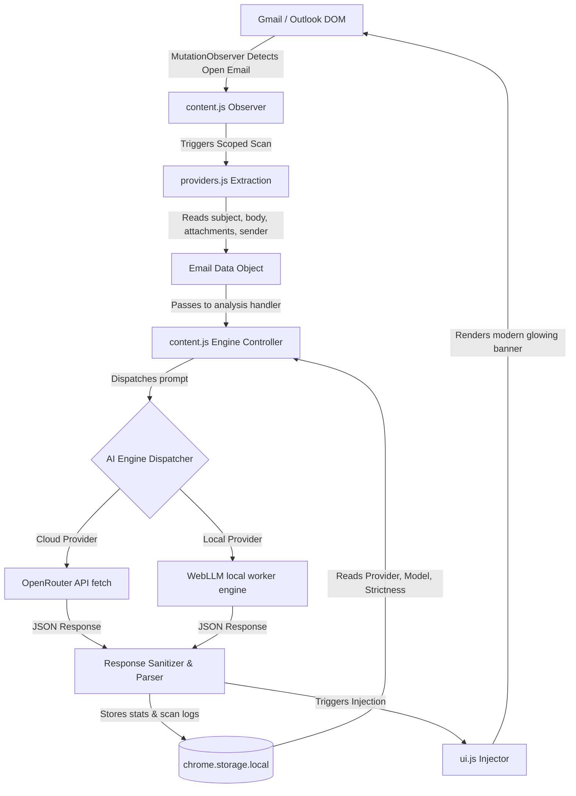

# 📐 PhishDetectAI System Architecture & Design

Welcome to the **PhishDetectAI** architectural documentation. This document outlines the system design, components workflow, advantages, problem statements resolved, and operational usage of this AI-powered email security Chrome Extension.

---

## 🔍 Problem Statement & Solutions

Traditional email filters (e.g., SPF, DKIM, DMARC, and static regex patterns) fail to intercept advanced **social engineering phishing** attacks. Impersonators often use:
- **Brand Mimicry**: Spoofing display names (e.g., "Netflix Support") while using unrelated sender domains.
- **Urgent Call-to-Actions (CTAs)**: Demanding immediate action under threats of account suspensions.
- **Dynamic Content**: Phishing texts that bypass traditional spam rules.

### **The PhishDetectAI Solution**
PhishDetectAI runs directly inside the client's browser, intercepting emails inside Gmail/Hotmail DOM trees. It extracts scoped metadata and forwards them to a Large Language Model (LLM) — either via **OpenRouter (Cloud AI)** or **WebLLM (Local Private AI)**. The model reviews:
1. Sender name vs domain alignment.
2. Cognitive urgency, panic-inducing threats, and sensitive info harvesting.
3. Link and attachment risks matching legitimate business communication standards.

---

## 🏗️ System Workflow Architecture

The following diagram illustrates how components interact, from email observation to analysis injection:



---

## 📦 Component Mapping

The extension is modularly partitioned into four core subsystems:

### 1. 🔍 Content Inspector & Extraction Subsystem
- **Main Script**: [content.js](file:///D:/GitHub/PhishDetectAI/src/content/content.js) — Establishes a `MutationObserver` to watch email viewports, coordinate configurations, and handle parsing states.
- **Provider Helper**: [providers.js](file:///D:/GitHub/PhishDetectAI/src/content/providers.js) — Extracts scoped DOM text nodes (subject, body, attachments, sender) relative to Gmail's `.adn.ads` and Hotmail's `.ReadMsgBody` classes.

### 2. 🤖 AI Inference Engines
- **Cloud Gateway**: Interfaces with `https://openrouter.ai/api/v1/chat/completions` using custom API keys for lightning-fast, high-precision semantic processing.
- **Local Engine**: Utilizes [worker.js](file:///D:/GitHub/PhishDetectAI/worker.js) coupled with WebWorker handlers to run ML compiler-compiled models (e.g., Llama-3.2, SmolLM2) fully offline within browser sandboxes.

### 3. 🎨 UI & Layout Render Subsystem
- **In-page Alert**: [ui.js](file:///D:/GitHub/PhishDetectAI/src/content/ui.js) — Creates, handles, and injects HTML banner templates into headers.
- **Style Overlays**: [styles.css](file:///D:/GitHub/PhishDetectAI/styles.css) and inline CSS definitions in [ui.js](file:///D:/GitHub/PhishDetectAI/src/content/ui.js#L141-L459) styling security tags, risk meters, and pulsing highlights.

### 4. 📊 Storage & Dashboard Controls
- **User Interface**: [popup.html](file:///D:/GitHub/PhishDetectAI/src/popup/popup.html) & [popup.css](file:///D:/GitHub/PhishDetectAI/src/popup/popup.css) — Renders the modern, glassmorphic Chrome Extension configuration popup.
- **Log Manager**: [popup.js](file:///D:/GitHub/PhishDetectAI/src/popup/popup.js) — Manages storage states, clears statistics, formats scan timestamps, and renders recent threat reports.

---

## ⚡ Key Advantages

- **Local-First Privacy Option**: Switching to WebLLM ensures that no email content ever leaves the browser, safeguarding corporate privacy.
- **Flexible Strictness Profiling**: Allows users to choose between **Generous**, **Balanced**, and **Strict** configurations to calibrate and eliminate false positive flags.
- **Detailed Security Reports**: Renders actionable analysis summaries rather than simple warnings, informing users *why* an email is suspicious.
- **Offline Capabilities**: Scans emails using cached models even during network outages.

---

## 💻 Developer & Production Guide

### Build Pipeline
This extension uses Webpack to bundle assets. Build the production package into `/dist` using:
```bash
npm run build
```

### Verification Suite
Execute Jest unit and integration tests:
```bash
npm test
```

### Installation
1. Compile the extension: `npm run build`.
2. Open Chrome and navigate to `chrome://extensions/`.
3. Enable **Developer mode** in the upper right.
4. Click **Load unpacked** and choose the `/dist` directory.
5. Enter your OpenRouter API Key in the settings tab, choose a model, and start scanning!
